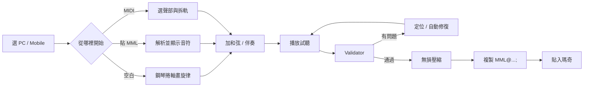
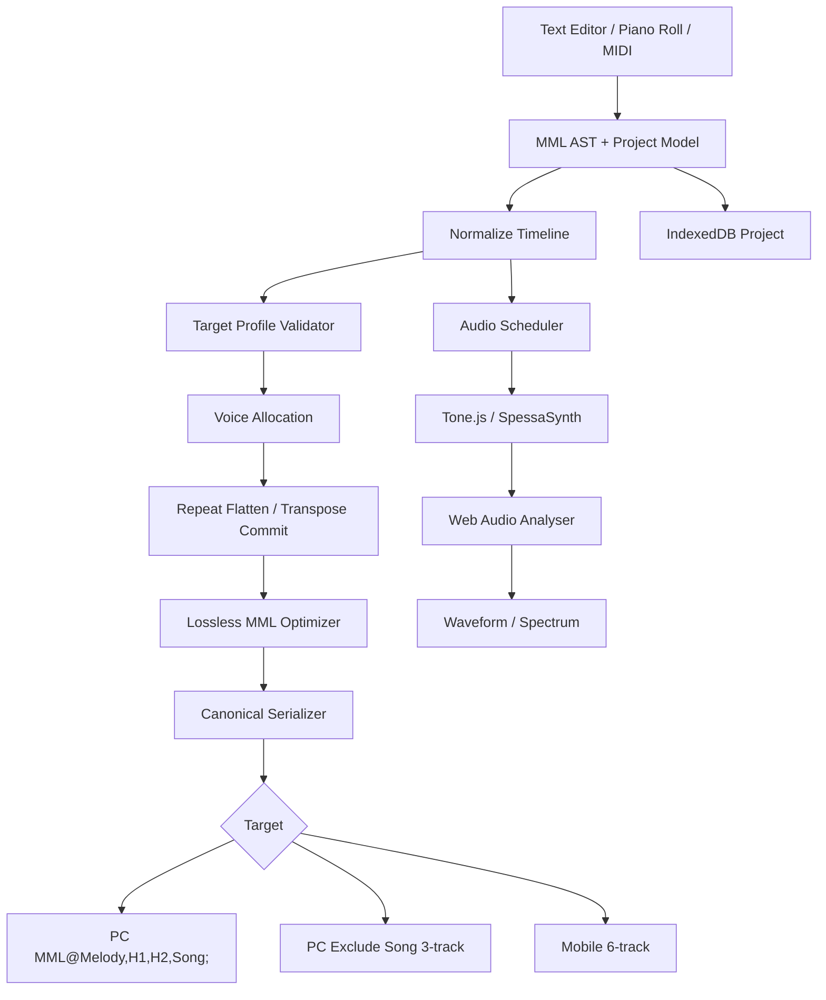

# 瑪奇（Mabinogi）樂譜製作深度研究與單頁網頁工具設計報告

## Executive Summary

本研究的核心結論是：**瑪奇樂譜不是一種完整的五線譜檔案格式，而是一套以 MML（Music Macro Language）純文字指令描述音高、音長、速度、力度與多軌聲部的遊戲作曲系統**。PC 版與瑪奇 Mobile 雖共享大量基本語法，但在軌數、字數上限、八度範圍、附點細節與部分相容行為上存在版本／方言差異，因此新工具**不能只有一個「Mabinogi MML」驗證模式，而應明確區分 PC 與 Mobile 目標 Profile**。Mabinogi World Wiki 記錄 PC 作曲介面具有 Melody、Harmony 1、Harmony 2、Song 四欄，Rank 1 一般容量為 1200／800／500，勾選 Exclude Song Part 後則可擴為 1600／1200／900；目前繁體中文 Mobile 社群工具則依實測規格採六軌、每軌 2400 字。citeturn16view2turn16view0turn14view2

本次搜尋沒有找到 Nexon 公開發布、逐一正式定義所有 MML token 的「官方語法規範書」。PC 細節主要由 Mabinogi World Wiki 長期整理；2026 年仍在運作的繁體中文「夜光 MML 工坊」則提供 Mobile／PC 編輯器與實測語法文件；Nexon 官方 Mabinogi Mobile 社群上亦有玩家直接發布六人合奏譜，能佐證實際遊戲中的多軌編排方式，但那些帖子仍屬**官方平台上的玩家內容，而不是官方技術規格**。citeturn14view1turn15view0turn19view3

因此，我建議這個新工具採取「**視覺編輯為主、MML 為底層真實格式**」的設計：初學者可以像使用簡化 DAW 一樣在鋼琴捲軸拖放音符、框選後重複／轉調／拉伸音長、選 BPM 與樂器；熟悉 MML 的使用者則可以直接編輯文字。兩種模式共享同一份 AST／時間線資料，所以任何視覺變更會即時反映成 MML，任何 MML 修改也會立即更新鋼琴捲軸與聲音預覽。現有繁中工具已證明瀏覽器內 MIDI 匯入、鋼琴捲軸、語法上色、本機自動儲存、近遊戲音色試聽等功能是可行的。citeturn14view4turn22search0

真正的「和弦」也應由工具替使用者處理。瑪奇核心格式中，一條軌道本質上是單音序列；Mobile 現行社群文件明確指出 `[ceg]4` 之類的和弦語法只是編輯器擴充，**不是遊戲原生語法**，真正同時發聲必須拆到多軌。MIDI → MML 同樣必須把 MIDI 的複音內容取捨／拆成有限的單音軌。citeturn14view2turn15view1

最重要的產品決策如下：

| 決策 | 建議 |
|---|---|
| 核心資料模型 | 自建 MML Parser → AST → Rational Timeline → Serializer |
| 目標格式 | `PC`、`PC Exclude Song`、`Mobile 6-track` 三種 Profile；另設保守相容模式 |
| 初學者主介面 | 鋼琴捲軸 + 鍵盤 + Track Lane，而不是先要求懂 MML |
| 進階介面 | Monaco/CodeMirror 類型文字編輯器，語法高亮與錯誤定位 |
| 音頻 | MVP 可用 Tone.js；追求瑪奇近似音色則優先 SpessaSynth + 合法 DLS/SF2 |
| 波形／頻譜 | Web Audio `AnalyserNode` |
| 儲存 | Local-first：IndexedDB；雲端分享為選配 |
| 後端 | **未指定**；MVP 不需要後端 |
| 部署環境 | **未指定**；核心可部署為靜態 SPA |
| 和弦／重複／轉調／拍號 | 在工具內當高階編輯功能；匯出前展開成遊戲可接受的基本 MML |
| 第一優先驗證 | 軌數、字數、全域 Tempo、非法 token、八度／音域、`n`、和弦擴充語法、PC/Mobile 方言差異 |
| 最值得避免的錯誤 | 把不同 MML 方言「混成一套語法」，導致工具能播、遊戲卻不能貼 |

## 研究範圍、五個替代範例頁面與來源可信度

使用者本輪訊息中**沒有實際附上所稱的五個範例 URL**。為避免中斷研究，本報告改以五個可直接查閱、能代表 PC、PC 高容量與 Mobile 多軌實務的原始樂譜頁作為「替代研究樣本」。這一點很重要：以下五頁**不是冒充使用者原本提供的頁面**，而是為完成本輪分析而選出的代表樣本。

| 樣本 | URL | 為何選它 | 觀察 |
|---|---|---|---|
| A：Space Walk | `https://mabinogi.fws.tw/ac_compview.php?cid=017212` | 近期繁中 PC 實例 | 主音 549、兩條和弦 274／482；大量使用 `t`、`v`、`l`、`n`、`&`、八度切換；頁面亦提供可直接複製的 MML 包裝格式。citeturn17search0 |
| B：甲乙丙丁 | `https://mabinogi.fws.tw/ac_compview.php?cid=017214` | 中型三軌 PC 編曲 | 主音 820、和弦 546／539，速度 `t65`；可觀察 `nXX` 與長伴奏軌如何混合使用。citeturn20search0 |
| C：YOASOBI アンコール | `https://mabinogi.fws.tw/ac_compview.php?cid=016985` | PC Rank 1 高容量極端案例 | 頁面明示 Rank 1 勾選「排除歌曲部分」，三軌正好使用 1600／1200／900 的擴容量級，與 Wiki 所列 Exclude Song Part 上限一致。citeturn20search2turn16view0 |
| D：瑪奇M－螺旋 | `https://mabinogi.fws.tw/ac_compview.php?cid=017218` | 繁中 Mobile 樂譜案例 | 標記為瑪奇M，三條可見聲部約 1114／1093／689；使用 `t71`、升音、附點、tie、八度移動等長篇 MML。citeturn19view2 |
| E：Red Velvet – Power Up 六人合奏 | `https://mabinogimobile.nexon.com/Community/Art/3404214` | Nexon 官方 Mobile 社群上的原始玩家貼文 | 作者明列六人用的 Violin、Flute、Lute、Piano、Cymbals、Bass Drum，且表示四人版因字數超限而未附；也說移除最後兩條打擊軌即可用無打擊版本。citeturn19view3 |

樣本 A–D 來自繁體中文 Mabinogi Fantasy World「奇幻音樂廳」。該網站本身明確標示為非官方 Mabinogi 資料／交流網站，因此它非常適合拿來研究**真實玩家的樂譜內容與格式習慣**，但不能把其中每一種寫法直接視為 Nexon 正式規格。citeturn17search0turn19view2

格式研究則交叉比對下列主要來源：

| 來源 | 角色 | 本報告使用方式 |
|---|---|---|
| `https://wiki.mabinogiworld.com/view/MML` / MML 101 | 長期 PC 社群規格整理 | PC 指令、Tempo、Score Part、`n`、匯出格式等。citeturn14view1 |
| `https://wiki.mabinogiworld.com/view/Compose` | PC 作曲技能／介面資料 | PC 欄位、Clipboard、Rank 字數上限、Exclude Song、已知遊戲問題。citeturn16view0turn16view2 |
| `https://mml.mabi.tw/guide/mml` | 2026 年繁中 Mobile 實測語法 | Mobile 六軌／2400、八度、雙附點、全域 tempo、遊戲非原生和弦等。citeturn15view0 |
| `https://mml.mabi.tw/guide/midi` | 目前 Mobile MIDI→MML 實務 | 複音降軌、量化、MIDI 與 MML 能力落差。citeturn15view1 |
| `https://3ml.mabi.tw/` | 目前繁中 PC 編輯器 | 現行 PC 網頁工具在鋼琴捲軸、移調、優化、播放等 UX 上的現況參考。citeturn22search0 |
| Nexon Mabinogi Mobile Community | 官方平台、玩家 UGC | 六人合奏與字數問題的實務佐證，不當作官方 token specification。citeturn19view3 |

**研究可信度上的關鍵警告**是「MML 方言差異」。例如目前 Mobile 文件將有效 `o` 八度描述為 `o1`–`o7`，且明確支援 `c4..` = 1.75 倍；另一方面，PC 長期社群文件與各樂器音域紀錄包含 octave 0 的 `n` 用法，甚至有少數特殊樂器延伸到較高八度。PC MML 101 又記錄 `n97`–`n127` 不會產生一般音符。這些資料不宜強行合併成一條「宇宙真理」，而應在工具中做成 **target profile + warning level**。citeturn15view0turn14view1turn13search1

## 瑪奇 MML 格式、語法、限制與常見錯誤

MML 是狀態式語言。解析某顆 `c`，不能只看這個字元；還要知道前面目前的 `o`、`l`、`v`，以及全曲目前生效的 `t`。這正是網頁工具不能用幾個 Regex 就草率完成的原因。Mobile 現行文件也特別提醒 Tempo 並不是每軌獨立，而是整首共享；同一時間多軌發出 Tempo 指令時，其工具會依軌序整合成單一 tempo map。citeturn15view0

### 格式規格比較

| 項目 | 基本語意 | PC | Mobile / 目前繁中實測 | 工具實作方式 |
|---|---|---|---|---|
| 包裝 | `MML@...;` | 常見完整格式為 `MML@Melody,Harmony1,Harmony2,Song;`。citeturn14view1 | 六軌以逗號分隔，前置 `MML@`、結尾 `;`。citeturn14view2 | Parser 可接受有／無 wrapper；Export 一律產生 canonical wrapper |
| 聲部 | 逗號隔開獨立單音序列 | Melody + Harmony 1 + Harmony 2，另有 Song 欄；Song 有獨立規則。citeturn16view2turn14view1 | 現行繁中工具／社群採最多六個遊戲軌。citeturn14view2turn19view3 | `TargetProfile.trackCount` |
| PC Rank 1 | 每欄容量不同 | 1200／800／500；Exclude Song → 1600／1200／900。citeturn16view0 | 不適用 | Rank 下拉選單直接驅動 validator |
| Mobile 容量 | 每軌限制 | 不適用 | 目前繁中實測文件為每軌 2400；官方社群帖子亦反覆出現因 2400／字數容量而壓譜的實務。citeturn14view2turn18search5turn18search9 | 逐軌 meter，不只顯示全曲總字數 |
| 音符 | `c d e f g a b` | 基本 MML | Do、Re、Mi、Fa、Sol、La、Si。citeturn15view0 | Piano note ↔ MML token 雙向映射 |
| 休止 | `r` | 支援 | 支援。citeturn15view0 | Timeline event: Rest |
| 升降 | `+` / `#`，`-` | 基本 MML | `c+`／`c#` 升、`d-` 降。citeturn15view0 | AST 內統一成 chromatic pitch，Serializer 再選最短 spelling |
| 預設音長 | `lN` | 狀態式 | 例如 `l8 cdef` 等同每顆八分音符。citeturn15view0 | Track State |
| 個別音長 | `c1 c2 c4 c8 c16…` | 分母形式 | 全、二分、四分、八分、十六分等；真實譜亦大量出現 `l12`、`l24` 等非二次方分母。citeturn15view0turn20search2 | 用 rational duration，不能用浮點累積 |
| 附點 | `.` | PC 資料與版本間有歷史差異 | 現行 Mobile 文件明列 `c4.` = 1.5、`c4..` = 1.75。citeturn15view0 | Mobile 可通過；PC profile 對多重附點提供相容性警告 |
| 八度 | `oN` | 樂器實際可發聲音域差異很大；`n` 可涉及 octave 0。citeturn13search1turn14view1 | 目前文件定義 `o1`–`o7`，`o4c` 為中央 Do。citeturn15view0 | 先驗證語法範圍，再用 instrument range 額外提示 |
| 相對八度 | `<` / `>` | 基本 MML | `<` 降八度、`>` 升八度。citeturn15view0 | Piano-roll 移動音符後由 serializer 自動決定 `o` 還是 `< >` 較短 |
| Tempo | `tN` | PC MML 101 記載預設 120、32–255；一次設定會影響後續。citeturn14view1 | 全曲共享，不是每軌各自 BPM。citeturn15view0 | 全局 TempoMap；衝突報警，匯出時集中到主軌 |
| 力度 | `vN` | 舊 PC 資料常見 1–15 | 現行 Mobile 文件為 0–15。citeturn15view0 | Profile-specific validation |
| 連音 | `&` | 同音延長 | `c1&c1` 將同音接成長音。citeturn14view2 | 驗證左右 pitch 相同 |
| 絕對音高 | `nN` | MML 101 記錄 `n97` 以上有 PC 相容性／無聲問題。citeturn14view1 | `n48 = o4c`；不改變當前 `o` 狀態。citeturn14view2 | 顯示 note name，PC 對高 `n` 做黃色／紅色警告 |
| 和弦 | 同時多音 | 以多條 Melody/Harmony 實現 | `[ceg]4` 是工具擴充，不是遊戲原生；真正和弦需拆軌。citeturn14view2 | UI 允許畫 chord，Exporter 做 voice allocation |
| 樂器 | 音色 | 樂器與樂譜本身是不同層次，實際音域因樂器而異。citeturn13search1 | 現行工具也以軌道的樂器選單管理，而非把音色指令寫入標準 MML。citeturn14view2 | instrument 存 project metadata，不污染 MML |
| 拍號 | 編輯網格概念 | 本次核心 MML token 文件未見一般拍號 token | 現行工具有拍號顯示／變拍，但屬編輯器功能。citeturn14view4 | Project metadata；控制小節線與量化，不直接假定遊戲吃拍號 token |
| 重複 | 高階編輯概念 | 本次核心語法文件未見遊戲 repeat block | 同左 | `Section.repeatCount`，匯出時展開 |
| 轉調 | 高階編輯概念 | 本次核心語法文件未見遊戲 transpose token | 現行 PC 工具已有「移調」按鈕作為編輯操作。citeturn22search0 | 修改 AST pitches，再重新序列化 |

其中有一個很容易誤解的點：**拍號和 Tempo 不一樣**。`t120` 是 MML 音樂播放指令；而 4/4、3/4、6/8 在這個工具中首先應被視為「如何畫小節線、如何 snap、如何計算一小節」的編輯器 metadata。現行繁中 Mobile 工具也將拍號描述成控制小節線、每小節格數、插入／刪除小節與換行的功能。citeturn14view4

同理，工具可以讓使用者按「重複 4 次」，但遊戲匯出層不應偷偷創造一個沒有實證的 repeat token，而是展開四次之後再進行無損壓縮。和弦也是如此：畫面可以容許同一時刻疊三顆音，但匯出必須把它配置到不同單音軌。現行 Mobile 文件已直接把 `[ceg]` 列為「可以在工具播放、但貼回瑪奇不會動」的非原生語法。citeturn14view2

**建議建立三組驗證 Profile：**

| Profile | 目的 | 核心限制 |
|---|---|---|
| `PC-Rank` | 一般 PC Score Scroll | 3 樂器聲部 + Song 規則；依 Compose Rank 套用欄位容量。citeturn16view0turn16view2 |
| `PC-ExcludeSong` | PC 最大三軌容量 | Rank 1 可到 1600／1200／900；實例 C 正好用滿這組額度。citeturn16view0turn20search2 |
| `Mobile-6Track` | Mobile | 六遊戲軌、每軌 2400，`o1–o7`、`v0–15` 等依目前實測文件。citeturn15view0 |

再增加一個不直接代表遊戲版本的 `Conservative` 模式：不輸出 `[ceg]`、不輸出工具私有 token、對雙附點與高 `n` 做警告、限制到三軌就能演奏的聲部核心。這可以用來交換舊譜，但不應宣稱它能保證所有 Mabinogi 年代／地區版本完全一致。

**常見錯誤與應顯示的提示：**

| 錯誤 | 工具提示 |
|---|---|
| `MML@`／逗號／`;` 結構錯 | 「無法判斷軌道：缺少分隔符／結尾 `;`」 |
| 把 `[ceg]4` 當遊戲和弦 | 「此語法只供部分編輯器試聽；請按『拆成多軌』」。citeturn14view2 |
| 每條軌各寫不同 `t` | 「Tempo 為全曲共享；目前第 1、3 軌在同一位置衝突」。citeturn15view0 |
| Mobile 某軌 > 2400 | 顯示 `2437 / 2400`，並提供無損壓縮與聲部精簡建議。citeturn14view2 |
| PC 超過 Rank 欄位容量 | 顯示目前 Rank 的三欄額度，另提示是否能使用 Exclude Song。citeturn16view0 |
| `&` 前後不是同音 | 「Tie 應延長相同 pitch；此處可能是誤植」 |
| `n97` 等 PC 高絕對音高 | 「PC 社群規格記錄此範圍可能不發聲；請試轉成較低 octave／確認樂器」。citeturn14view1 |
| 音高超出指定樂器有效區 | 「MML 可解析，但這個樂器的實際發聲音域可能不同」。不同樂器的音域確有顯著差異。citeturn13search1 |
| 末尾塞很多 `r` | PC Wiki 記載尾端未整理的休止符可能導致演奏動畫持續。citeturn16view0 |
| 極低 Tempo | PC Wiki 記錄約 T40 以下曾有演奏動畫／結束問題，宜提示而非一律判為非法。citeturn16view0 |
| MIDI 匯入後少很多音 | 不是 parser 壞掉：MIDI 可複音，而瑪奇單軌同時只能留一音，必須做 voice allocation。citeturn15view1 |
| MIDI pitch bend／踏板不見 | 現行轉換文件指出這些表現並沒有直接的瑪奇 MML 對應。citeturn15view1 |
| 三連音匯入偏掉 | 現行 Mobile 工具採 1/32 網格量化時會犧牲部分三連音精度。新工具應把量化精度變成設定，而不是硬寫死。citeturn15view1 |

## 單頁工具功能、UX/UI 與操作流程

這個產品最重要的 UX 原則應該是：**不要先教使用者寫程式，再讓他寫音樂。** 初次進入畫面，只需回答三個問題：「要給 PC 還是 Mobile？」「從空白開始、貼 MML、還是匯入 MIDI？」「想用什麼樂器預覽？」之後即可開始拖音符。MML 文字永遠存在，但預設可以收合。

### 必備功能清單

| 功能 | 優先級 | 設計 |
|---|---:|---|
| MML 文字輸入 | P0 | 語法高亮、括號／token 色彩、錯誤波浪線、逐軌字數 |
| 視覺 Piano Roll | P0 | 左側鍵盤、時間橫軸、音符拖放、拉右緣改長度 |
| MML ↔ 視覺雙向同步 | P0 | 統一 AST，不維護兩份資料 |
| 即時播放／暫停／停止 | P0 | 從游標、選取區、全曲播放 |
| 遊戲格式匯出 | P0 | PC、PC Exclude Song、Mobile 六軌 |
| Tempo | P0 | 全局 tempo lane；MML `t` 變更即時反映 |
| 拍號 | P0 | 編輯器小節／snap metadata；支援途中變拍 |
| 力度 | P0 | MML `v` 與區域批次調整 |
| 音色 | P0 | Preview instrument metadata；不假裝它是核心 MML token |
| 和弦 | P0 | UI 可同時畫多音；匯出自動拆軌 |
| 分段／Section | P0 | Intro、A、B、Bridge 等標籤 |
| 重複 | P0 | UI repeat block，匯出前展開 |
| 轉調 | P0 | 半音 ±1、八度 ±12、指定調性移調 |
| Validator | P0 | 即時錯誤＋警告＋可自動修復 |
| 範例載入 | P0 | 至少三個內建教學模板 |
| 本機自動儲存 | P0 | IndexedDB |
| `.mml` 匯入／匯出 | P0 | 純文字 |
| 專案 JSON | P0 | 保存 instrument、meter、section、viewport 等 MML 外資料 |
| 行動版 | P0 | Touch／Pointer、底部播放列、抽屜式 Inspector |
| 波形／頻譜 | P1 | `AnalyserNode` + Canvas |
| MIDI 匯入 | P1 | 可選高音、低音、智能拆分 |
| MIDI 匯出 | P1 | 方便回 DAW 修改；不是遊戲 native |
| DLS/SF2 音色 | P1 | SpessaSynth |
| 無損壓縮 | P1 | `l/o/v` 狀態最佳化、空白移除、最短等價表示 |
| WAV/MP3 | P2 | 離線渲染，與遊戲 MML 匯出分開 |
| 雲端分享 | P2 | 可選登入；不應是基本編曲前提 |
| OMR 圖片／PDF 樂譜辨識 | P3 | 高成本附加模組，不建議 MVP 先做 |

現存繁中 Mobile 工具已包含 MIDI、MML/MMI 匯入、鋼琴捲軸、語法上色、本機自動存檔、DLS/SF2、自訂樂器、拍號、小節處理等功能，證明這些 UX 元件符合現有瑪奇作曲使用情境。citeturn14view4 現行 PC 工具也直接提供播放、範圍循環、量化長度、速度、力度、移調、優化與合併等操作。citeturn22search0

**建議單頁版面：**


[下載 SVG 介面示意圖](sandbox:/mnt/data/mabinogi_mml_singlepage_wireframe.svg)

桌面版採「左文字、中 Piano Roll、右 Inspector、底 Transport」；行動版則把這三欄變成「樂譜／捲軸／設定」三個可滑動頁籤，但底部 Transport 永遠保留。如此不需要另開「設定頁」「匯出頁」「錯誤頁」，符合使用者要求的**所有步驟在同一頁完成**。

**Piano Roll 操作約定：**

| 動作 | 桌面 | 行動 |
|---|---|---|
| 加音符 | 左鍵空白格 | Tap |
| 移動 | 拖音符 | Drag |
| 改長度 | 拉右緣 | 拖右側 handle |
| 刪除 | Delete / Backspace | 長按 → 刪除 |
| 多選 | Shift / 框選 | 長按進多選 |
| 播單音 | 點左側 Piano Key | Tap Piano Key |
| 轉調 | 選取後 ↑↓ 或 Toolbar | 選取 →「移調」 |
| 重複 | Ctrl/Cmd+D | 選取 →「重複」 |
| 複製 | Ctrl/Cmd+C/V | Action Sheet |
| 水平縮放 | Ctrl+wheel | pinch |
| 移動畫布 | 中鍵／Space+Drag | 雙指拖曳 |

右側 Validator 不應只寫「Syntax Error」。例如：

> **軌 3，字元 382：`[ceg]4`**  
> 可以在目前預覽器播放，但不是 Mobile 遊戲原生和弦。  
> `[ 自動拆為三軌 ] [ 保留但不允許遊戲匯出 ]`

這種錯誤訊息是必要的，因為現行社群文件已明確證實這是非常常見的誤解。citeturn14view2

波形／頻譜區不應自行做 DSP。Web Audio 已提供 `AnalyserNode`，可以取得 frequency-domain 與 time-domain 資料，交給 `<canvas>` 畫即時 waveform、頻譜柱狀圖或 piano-spectrum。citeturn22search7turn22search8

整個新手流程可以壓縮為：



實際操作上，使用者從來不需要離開這張單頁。

## 技術架構與前後端實作規格

**推薦架構為 TypeScript SPA。** React + Vite 或 Vue 3 + Vite 都適合；本案真正的技術風險不在 UI framework，而在 MML parser、時間線、跨軌 tempo、聲部配置與音訊 scheduler。因此應讓核心 `mml-core` 完全不依賴 React/Vue，否則日後做 CLI、測試器或其他前端會很痛苦。

推薦模組結構：

```text
packages/
  mml-core/
    lexer.ts
    parser.ts
    ast.ts
    timeline.ts
    validator.ts
    profiles/
      pc.ts
      pc-exclude-song.ts
      mobile.ts
    serializer.ts
    optimizer.ts
    transpose.ts
    voice-allocation.ts

  audio-engine/
    scheduler.ts
    tone-adapter.ts
    spessa-adapter.ts
    analyser.ts

  midi/
    import.ts
    export.ts
    quantize.ts

apps/
  web/
    editor/
    piano-roll/
    inspector/
    transport/
    export/
```

**解析器不可直接把 MML 轉秒數。** 最穩健的模型是：

`MML Text → Tokens → AST → Musical Rational Timeline → Global Tempo Map → Playback Seconds`

例如四分音符可保存為 `1/4 whole note`，八分音符保存 `1/8`，`c4.` 是 `3/8`，雙附點則是 `7/16`。這可以避免長樂譜使用浮點秒數累加後造成跨軌 drift。直到真正播放時，才透過 Tempo Map 換成 Web Audio 時間。

Track parser 需要各自維護：

```text
TrackState
  octave
  defaultLength
  volume
  cursor
```

但 Tempo 應合併為：

```text
GlobalTempoMap
  [{ musicalTime, bpm, sourceTrack }]
```

目前 Mobile 實測文件明確說明 `t` 是全曲共用，而不是每軌獨立，因此這一層不能省。citeturn15view0

**視覺和弦的核心演算法**則是：

```text
Chord / MIDI Polyphony
        ↓
同一時刻所有 active pitches
        ↓
Voice Allocation
        ↓
Track 1: monophonic voice
Track 2: monophonic voice
Track 3: monophonic voice
...
        ↓
依 PC / Mobile 最大軌數裁切或重新分配
```

現行 MIDI→MML 文件把這個問題描述得很清楚：MIDI 同一聲部可同時有多音，而瑪奇 MML 一軌只能保留單音；該工具因此提供旋律優先、根音優先與旋律＋根音等採樣策略。citeturn15view1 新工具可以進一步做 interval continuity cost，盡量減少聲部跳躍：

\[
cost = w_p |\Delta pitch| + w_g gap + w_r rangePenalty
\]

然後用 greedy allocation 即可完成 MVP；大型版本再考慮動態規劃。

### 技術選項比較

| 項目 | 選項 | 優點 | 限制／建議 |
|---|---|---|---|
| Web Audio 原生 | `AudioContext` | 最少依賴，可完全控制 graph | 自己寫 scheduling／instrument 工作較多；Web Audio 本身提供 node graph、offline rendering、AudioWorklet 等能力。citeturn22search1 |
| Tone.js | **推薦 MVP** | 有 Transport、scheduler、synth、effects；官方定位就是 browser interactive music framework。citeturn21search0 | 合成音不等於瑪奇遊戲音色 |
| Tone.Sampler | MVP+ | 可按 MIDI/note 對應 sample，缺樣本的 pitch 可 repitch。citeturn21search4 | 完整樂器庫會增加下載量 |
| SpessaSynth | **推薦精準預覽版** | Browser TS/JS，支援 SF2/SF3/DLS/MIDI，WebAudio wrapper；Apache-2.0。citeturn21search3 | 音色檔本身仍須獨立確認可否散布 |
| `@tonejs/midi` | MIDI I/O | Browser 可讀／寫 MIDI，能取得 tempo、time signature、PPQ、note、velocity 等結構；MIT。citeturn23search1turn23search3 | MIDI → MML 仍需自建降軌與量化 |
| `AnalyserNode` | **推薦** | 原生提供 waveform／FFT 資料。citeturn22search7turn22search8 | Canvas redraw 要限制 FPS |
| AudioWorklet | 大型版 | DSP 可離開主 UI thread；MDN 也將它定位為取代舊 ScriptProcessor 的背景音訊處理方式。citeturn22search1turn22search4 | 基本 Tone.js MVP 不必自己寫 processor |
| Web Worker | **推薦** | 可把大型 MIDI、parse、compress、voice allocation 放背景 thread，不阻塞 UI。citeturn22search3 | AST 傳輸應避免大量細碎 message |
| IndexedDB | **推薦** | 可在瀏覽器保存大量 structured data 與 file/blob，適合專案與音色快取。citeturn22search2 | 要做 schema migration |
| localStorage | 僅小設定 | 簡單 | 不適合完整專案／大型 asset |
| 後端 | 選配 | 分享、登入、跨裝置同步 | **語言：未指定；部署：未指定；MVP 完全可以沒有後端** |

Tone.js 本身採 MIT License。citeturn21search1 現行繁中 Mobile 工具則實際採 SpessaSynth 4.3 做 SF2／DLS 與 AudioWorklet 播放，並列出 Audiveris、lamejs 等其他元件，這是很有價值的現成架構參考。citeturn14view4

**聲音引擎建議採兩層模式：**

`Fast Preview` 使用 Tone.js 簡單 synth，啟動快；`Game-like Preview` 載入 DLS/SF2 後切 SpessaSynth。UI 要明白標成「合成預覽」與「遊戲近似音色」，不要宣稱網頁聲音與所有遊戲客戶端 100% bit-perfect。另一個 MIT 開源專案 MabiMmlEmu 也自稱目標是接近 Mabinogi 音色，但其 README 同時承認某些 2014 年後加入的樂器無法正確重現，正好證明「模擬音色」本身需要版本化測試。citeturn23search0

**儲存格式建議：**

遊戲交換：

```text
song.mml
UTF-8 / plain text
MML@...;
```

完整專案：

```json
{
  "schemaVersion": 1,
  "title": "My Score",
  "target": "mobile",
  "timeSignatures": [
    { "time": "0/1", "numerator": 4, "denominator": 4 }
  ],
  "tracks": [
    {
      "name": "Melody",
      "instrumentId": "piano",
      "mml": "t120v12o4l4cdef"
    }
  ],
  "sections": [],
  "view": {
    "zoom": 1,
    "scrollBeat": 0
  }
}
```

`.mml` 只保存能交給遊戲的資料；`.json` 才保存拍號、Section 名稱、預覽樂器、UI zoom、非破壞性 repeat 等工具資訊。

**匯出 pipeline：**



Optimizer 應分成「**無損壓縮**」與「**音樂取捨型優化**」兩顆按鈕。無損版只做 `l` 最佳化、冗餘 `o/v` 移除、等價 `< >`／`n` 選擇、空白移除等；任何會縮短 sustain 或刪音的動作都不能偷偷歸在「壓縮」裡。現行 Mobile 工具也把改變音符延／收音的 optimization 明確區分成可能改變聲音的操作。citeturn15view1

效能方面，大型 MML parsing／optimizer／MIDI voice allocation 放 Web Worker；音訊處理可利用 AudioWorklet；Piano Roll 只 render viewport 可見音符。Web Worker 本來就是為了把耗時計算移出 UI thread，AudioWorklet 則專門讓音訊處理離開主線程。citeturn22search3turn22search4

## 實作里程碑、工時、人力、測試與授權

由於預算與時程均**未指定**，以下是產品開發估算，而不是固定報價。工時包含開發、基本測試與整合，但不包含大規模遊戲客戶端逆向工程或購買／重新製作完整樂器音色資產。

### 規模與時間估算

| 方案 | 範圍 | 估計工時 | 建議人力 | 團隊日曆時間 |
|---|---|---:|---|---|
| 小型 MVP | PC/Mobile parser、文字編輯、基本 Piano Roll、Tone 預覽、Validator、local save、MML export、3 範例 | 約 180–260 小時 | 1 名資深 TS/前端 + 兼職 MML QA | 約 5–8 週 |
| 中型正式版 | MVP + MIDI、SpessaSynth、完整六軌、進階 Piano Roll、波形、無損 optimizer、行動優化、完整測試 | 約 420–650 小時 | 2 前端/TS + 0.5 音訊/MML + UX/QA | 約 10–14 週 |
| 大型產品版 | 中型 + 雲端分享、登入、版本歷史、WAV/MP3、OMR、完整樂器資料庫、PWA/i18n/a11y、自動回歸 | 約 900–1400 小時 | 2–3 FE、1 audio/domain、1 UX、1 QA，後端兼職或全職 | 約 4–6 個月 |

**小型 MVP 的里程碑**建議依功能風險而不是畫面順序安排：

| 階段 | 交付 | 工時估算 |
|---|---|---:|
| MML Core | Lexer、Parser、AST、timeline、PC/Mobile profiles、serializer | 45–65 h |
| Validator | limits、tempo conflict、octave、tie、illegal extension、error range | 25–35 h |
| Piano Roll | keyboard、grid、drag、resize、selection、snap | 35–50 h |
| Audio | scheduler、Tone、loop、cursor | 20–30 h |
| Editor Integration | text ↔ AST ↔ visual、undo/redo | 25–35 h |
| Save/Export/Mobile | IndexedDB、project JSON、clipboard、responsive | 15–25 h |
| QA/Docs | fixtures、教學、跨瀏覽器 smoke test | 15–20 h |

中型版再加入約 60–90 h MIDI voice allocation／quantization、50–80 h SpessaSynth 與音色管理、35–50 h optimizer、35–50 h Mobile touch refinement，以及更完整的自動測試。

### 核心測試案例

測試資料一定要同時包含人工極小案例與真實長譜；不能只拿「歡樂頌前四顆音」驗證 parser。

| 測試 | 預期 |
|---|---|
| `cdefgab` | 正確映射七音 |
| `c+c#d-` | enharmonic parser 正確 |
| `l8 cde4` | c/d 使用 default 1/8，e 使用 1/4 |
| `c4.` | 1.5 倍 |
| Mobile `c4..` | 1.75 倍；PC profile 視相容模式決定 warning |
| `o4c>c<c` | pitch 與 octave state 正確 |
| `n48` | 顯示為對應 `o4c`。citeturn14view2 |
| PC `n97` | 相容性 warning。citeturn14view1 |
| `c2&c4` | 一個延長事件 |
| `c2&d4` | tie mismatch warning |
| 多軌不同位置 `t` | 合併成一張 global Tempo Map |
| 同位置多軌衝突 `t` | 顯式 conflict，不默默造成不同步 |
| `[ceg]4` | 可選預覽，但遊戲 export 阻擋／拆軌。citeturn14view2 |
| PC 1201/801/501 | 一般 Rank 1 profile 報超限。citeturn16view0 |
| PC 1600/1200/900 | Exclude Song Profile 通過。citeturn16view0turn20search2 |
| Mobile 2401 字 | 單軌超限。citeturn14view2 |
| 6 軌 Mobile | 通過 |
| 7 軌 Mobile | 遊戲 export 阻擋；可保留為工作軌 |
| 3-note MIDI chord | 自動配置為最多三條 monophonic voice |
| 8-note MIDI chord→PC | 報告取捨，而不是靜默丟音 |
| Parse → Serialize → Parse | musical timeline 完全等價 |
| Transpose +12 | 所有非打擊 pitch 加一 octave |
| Repeat ×4 | export 展開後時間／事件正確 |
| 重新整理頁面 | IndexedDB project 恢復 |
| 1 萬+ note 專案 | drag 與播放期間 UI 不被 parser 阻塞 |

MIDI 測試尤其要包含 chord、sustain、triplet、tempo change，因為現有實務文件已指出 MML 與 MIDI 的複音、精度、樂器與表現控制能力並不等價。citeturn15view1

### 開源元件與授權

| 元件 | 授權／狀態 | 用途與注意 |
|---|---|---|
| Tone.js | MIT。citeturn21search1 | MVP scheduler/synth |
| `@tonejs/midi` | MIT。citeturn23search3turn23search4 | MIDI 讀寫 |
| SpessaSynth | Apache-2.0。citeturn21search3 | DLS/SF2/SF3 + WebAudio |
| MabiMmlEmu | MIT。citeturn23search0 | 可研究舊有 Mabinogi Web MML playback 方法，但 README 自述對部分較新樂器有相容限制 |
| Audiveris | 現行夜光工具列為 AGPL-3.0。citeturn14view4 | OMR 只建議大型版；正式產品導入前應單獨做授權審查 |
| lamejs | 現行夜光工具列為 LGPL-3.0。citeturn14view4 | 若要 MP3 export 才需要 |
| Font Awesome / Google Fonts | 現行工具分別列 CC BY 4.0 / OFL。citeturn14view4 | UI 資產，需保留適當 attribution／license notices |

另外必須把「**程式庫授權**」和「**音色／樂譜內容授權**」分開管理。就算 synth engine 是 Apache-2.0 或 MIT，也不代表某一組從遊戲取得的 DLS/SF2 音色資產因此自動可以隨產品重新散布。現行繁中工具也另外標示其預設音色包來源與作者，而非把它視為 SpessaSynth 授權的一部分。citeturn14view4

同理，五個研究頁中多數是玩家改編的現有歌曲。本報告以下提供的三份可載入 MML **不抄錄那些原曲的長篇樂譜內容**，而是取其「三軌編排」「PC 高容量與 Tempo／tie」「Mobile 六軌分工」等技術結構，重新寫成短篇教學譜。如此既可直接測試工具，也不會把研究報告變成第三方歌曲 MML 的完整再發布。

## 初學者教學、FAQ 與單頁工具使用方式

對完全不懂 MML 的使用者，應只教這八個動作。

| 步驟 | 使用者做什麼 | 工具替他處理什麼 |
|---|---|---|
| 選目標 | 選「PC」或「Mobile」 | 自動切換軌數、字數與相容驗證 |
| 設音樂 | BPM 120、4/4、Piano | 建立 tempo map、grid、preview instrument |
| 畫旋律 | 在 Piano Roll 點音符 | 自動產生 `o/l/cdef...` |
| 加和弦 | 同一位置畫 2–3 顆音 | 自動拆到 Harmony tracks |
| 調長短 | 拉音符右側 | 選擇一般音長、附點或 `&` |
| 試聽 | 按 ▶ | Web Audio 排程＋游標同步 |
| 修錯 | 看右側 Validator | 定位超字、tempo conflict、非法 token |
| 匯出 | 按「複製遊戲 MML」 | 展開 repeat、壓縮、加 `MML@`／`,`／`;` |

初學者不需要先理解 `l8`，但當他點一顆八分音符時，右側可以顯示：

```text
目前音符
音高：C4
音長：1/8
MML：c8
```

如此視覺操作同時自然變成 MML 教學。

最基本的文字知識只需要記：

```text
c d e f g a b = Do Re Mi Fa Sol La Si
r               = 休止
4 / 8 / 16      = 音長分母
l8              = 後續預設八分音符
o4              = 八度
> / <           = 升／降一個八度
t120            = 速度
v12             = 力度
&               = 把同音接長
n48             = 絕對音高
```

這些對應與現行繁中 Mobile MML 文件一致。citeturn15view0turn14view2

**FAQ**

| 問題 | 答案 |
|---|---|
| 為什麼我不能在一條軌寫 `[ceg]4`？ | 有些編輯器能拿它試聽，但目前 Mobile 文件明確指出這不是遊戲原生和弦語法；工具應自動把 C/E/G 拆到不同軌。citeturn14view2 |
| 為什麼改了 Harmony 軌的 `t`，主旋律也會變快？ | 因為 Tempo 是全曲共享的，不應把每軌當作獨立播放器。citeturn15view0 |
| 4/4 為什麼沒有出現在匯出的 MML？ | 本研究找到的核心 token 文件沒有把一般拍號列為遊戲 MML 指令；目前網頁工具也是以拍號控制編輯器的小節線、格數與換行。citeturn14view4 |
| 我畫一個 C 大和弦會用掉幾軌？ | 同時 C/E/G 至少需要三條單音 voice；PC 的三樂器聲部因此很快用滿，Mobile 六軌較有空間。PC/Mobile 軌結構分別見社群規格。citeturn14view1turn14view2 |
| 為什麼 MIDI 直接轉出來不像原曲？ | MIDI 能在一軌同時發多音，而瑪奇 MML 一軌只能保留單音；pitch bend、踏板等也沒有直接等價表示，所以轉換必然包含降軌與取捨。citeturn15view1 |
| 為什麼 Mobile 能用的譜，PC 可能警告？ | 軌數、容量及部分 dialect 行為不同。PC 還有 Compose Rank／Exclude Song 配額。citeturn16view0turn15view0 |
| 為什麼編輯器聽得到，進遊戲卻不一定一樣？ | 編輯器使用的 synth／soundfont 與遊戲客戶端可能不同；舊 Mabinogi Web 模擬器也明確記錄部分較新樂器無法準確播放。citeturn23search0 |
| 我需要懂 `n48` 嗎？ | 不需要。它主要適合 serializer／optimizer；目前 Mobile 文件定義 `n48 = o4c`，視覺模式應直接顯示 C4。citeturn14view2 |
| 可以只存瀏覽器、不登入嗎？ | 可以，而且建議預設如此。IndexedDB 可以保存大型 structured data 與 Blob；目前同類工具也已有瀏覽器本機自動儲存模式。citeturn22search2turn14view4 |

## 可直接載入的三份教學樂譜與匯出示意

以下三例分別取樣本 **A「Space Walk」的三軌編排觀念**、樣本 **C「アンコール」所代表的 PC Exclude Song／長譜壓縮需求**、以及樣本 **E「Power Up」的六聲部分工觀念**。原始研究頁確實展現三軌、1600/1200/900 高容量與六人多樂器配置。citeturn17search0turn20search2turn19view3

但下列旋律均為**本報告自行寫的短篇教學資料**，不是那些歌曲的轉錄。

**範例：三軌和聲入門 — 適合 PC**

可直接貼入本工具：

```text
MML@
t120 v12 o4 l4 c d e f g a b >c,
v8  o3 l2 c e f g,
v7  o3 l1 c c,
;
```

工具格式化後會顯示：

```text
Track 1 / Melody
t120 v12 o4 l4
c d e f | g a b >c

Track 2 / Harmony 1
v8 o3 l2
c e | f g

Track 3 / Harmony 2
v7 o3 l1
c | c
```

遊戲匯出示意：

```text
MML@t120v12o4l4cdefgab>c,v8o3l2cefg,v7o3l1cc,;
```

這個範例有意讓三軌時間完全一致：第一軌八個四分音符，第二軌四個二分音符，第三軌兩個全音符，皆為八拍。使用者因此能直接看到「**和弦不是把三個音寫在同一軌，而是讓不同軌在同一時間發聲**」的概念；這也正是目前 Mobile MML 教學對真正和弦的說明。citeturn14view2

修改練習：選取 Melody 全部按「+12」，觀察工具只改音高、不改時間；再把 Harmony 1 的 `v8` 拉到 `v5`，聽主旋律如何更突出。

**範例：附點、Tie 與中途變速 — 適合 PC**

可直接載入：

```text
MML@
t96 v12 o4
c4. c8 d4 e4
f2&f4 r4
t132 g8 a8 b4 >c2,

v8 o3 l1
c c g,

v7 o2 l1
f c g,

;
```

壓縮匯出：

```text
MML@t96v12o4c4.c8d4e4f2&f4r4t132g8a8b4>c2,v8o3l1ccg,v7o2l1fcg,;
```

解析：

`c4.` 是附點四分；`f2&f4` 是同一個 F 的二分＋四分延長；當 `t132` 到達第三段時，Tempo Map 從 96 切到 132，而伴奏軌也必須跟著變，因為 `t` 是全局狀態。PC MML 101 記錄 Tempo 預設 120、可中途重新設定；目前 Mobile 文件更明確指出多軌 Tempo 應合併成全曲速度表。citeturn14view1turn15view0

這一例適合教「Section」與「重複」。在視覺介面框選前八拍，按「重複 × 2」，工具專案裡可以暫時保留 repeat metadata，但按遊戲匯出時必須展開成普通音符並再壓縮；不應輸出自創的 repeat 指令。

修改練習：把 `t132` 改成 `t72`；Validator 不該報語法錯，但應提醒 PC 極低 Tempo 的既有遊戲行為風險只在更低區域變得顯著。PC Wiki 曾記錄約 T40 以下與演奏動畫異常相關。citeturn16view0

**範例：六軌 Mobile 編排 — 適合 Mobile**

可直接載入：

```text
MML@
t128 v12 o4 l8 c e g >c <g e c r,
v9  o4 l4 c e g c,
v8  o3 l4 e g c e,
v8  o3 l4 g c e g,
v7  o2 l2 c c,
v6  o2 l1 c;
```

Mobile 遊戲匯出：

```text
MML@t128v12o4l8ceg>c<gecr,v9o4l4cegc,v8o3l4egce,v8o3l4gceg,v7o2l2cc,v6o2l1c;
```

這一例的六軌都維持四拍長度。它對應的是樣本 E 所呈現的真正 Mobile 工作方式：六人／六聲部可以分配不同角色與樂器；官方 Nexon 社群該帖甚至明列 Violin、Flute、Lute、Piano、Cymbals、Bass Drum 六種分工。citeturn19view3 Mobile 現行繁中語法文件亦將遊戲格式描述為六軌、每軌 2400 字。citeturn14view2

在本工具裡，這六軌可以另存以下 project metadata：

```json
{
  "target": "mobile",
  "tempo": 128,
  "meter": "4/4",
  "tracks": [
    { "role": "Melody", "instrument": "Piano" },
    { "role": "Upper Harmony", "instrument": "Flute" },
    { "role": "Inner Harmony A", "instrument": "Lute" },
    { "role": "Inner Harmony B", "instrument": "Violin" },
    { "role": "Bass", "instrument": "Lute" },
    { "role": "Pedal Tone", "instrument": "Piano" }
  ]
}
```

這些樂器名稱只存在專案檔與預覽層，不應錯誤地塞進遊戲 MML。現行 Mobile 文件也明確指出某些外部 MML 的 `@` 樂器指令雖可讀入，但其工具並不把它當瑪奇原生有效音色指令，而是另外由樂器下拉選擇。citeturn14view2

修改練習是框選 Track 2–4 同一拍的 C/E/G，再按「合併為 Chord Object」。畫面可以只顯示一個 `C major` 和弦方塊，但 Exporter 必須重新拆回三條單音軌。接著切換 `PC` Profile，Validator 應立即指出「目前使用六個聲部，但 PC 樂器主體只有三條 Melody/Harmony 聲部」，並提供「自動保留旋律＋最高和聲＋低音」或手動選軌。PC 與 Mobile 的軌道模型差異正是整個工具不能用單一硬編碼規則的主要原因。citeturn14view1turn14view2

綜合來看，最合理的產品不是「另一個 MML 文字框」，而是**一個以遊戲格式為約束條件的小型音樂工作站**：使用者面對的是音符、和弦、段落、速度與樂器；Parser、Track Allocation、MML 壓縮和版本相容性則由系統在底層處理。現有 PC／Mobile 社群工具已分別證明鋼琴捲軸、MIDI 匯入、移調、拍號、近遊戲音色與本機儲存均可在瀏覽器完成；真正值得新工具投入工程資源的差異化，應是**嚴格的 PC/Mobile Profile、雙向視覺編輯、可解釋 Validator、可靠的 voice allocation，以及「編輯器高階功能 → 遊戲原生 MML」的可驗證轉換鏈**。citeturn22search0turn14view4turn15view1